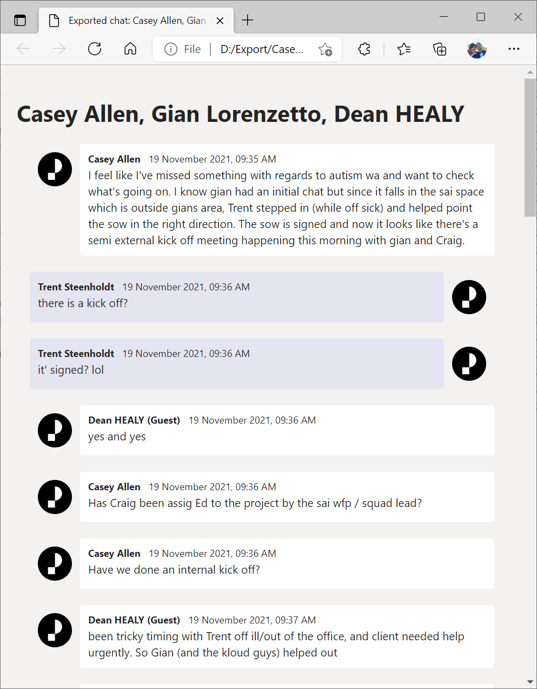
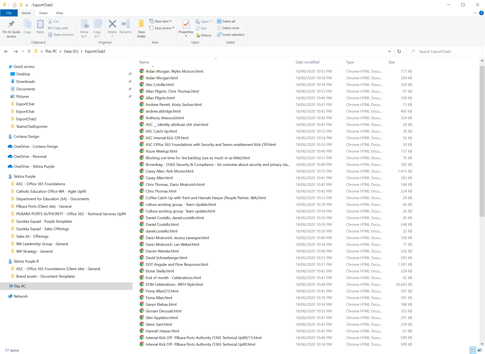

# Microsoft Teams Chat Exporter

The repository contains a PowerShell script that allows you to export your Microsoft Teams chat conversations, in HTML format, to your local disk.

# Note
Revamp in progress! Guide will be unavailable for the time being. Code is currently unstable.